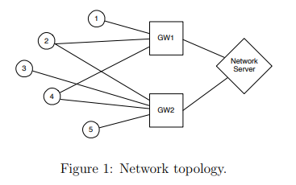
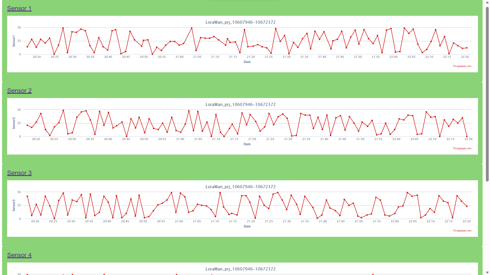

 # LoraWAN-like sensor network
 A.Y. 2022/2023 - Politecnico di Milano
 


 This repository includes the code for an eight node LoraWAN-like sensor network. Five sensor nodes send random data to two gateways which forward the messages to the central network server. The server is able to ingore duplicated messages and sends acknowledgements to the sensor node when receiving a new message.

 ## Project requirements

 Implement and showcase a network architecture similar to LoraWAN in
TinyOS. The requirements of this project are:
1. Create a topology with 5 sensor nodes, 2 gateway nodes and one network server node, as illustrated in Figure 1.
2. Each sensor node periodically transmits (random) data, which is received by one or more gateways. Gateways just forward the received
data to the network server.
3. Network server keeps track of the data received by gateways, taking
care of removing duplicates. An ACK message is sent back to the
forwarding gateway, which in turn transmits it to the nodes. If a node
does not receive an ACK within a 1-second window, the message is
re-transmitted.
4. The network server node should be connected to Node-RED, and periodically transmit data from sensor nodes to Thingspeak through MQTT.
5. Thingspeak must show at least three charts on a public channel.

<p align="center">
  
</p>

 ### Run the simulation

 Open the terminal and execute:
 
 ```console 
 git clone https://github.com/RaffaeleBerzoini/LoraWAN-like_sensor-networks
 cd LoraWAN-like_sensor-networks
 make micaz sim
 ```
 Before running the simulation open node-red and import the flow contained in the `nodered_flow.txt` file. The _thingspeak builder_ node and the MQTT node (_channels/2232200/publish_) will require to update the topic with your channel ID and also the credentials to access your MQTT device on Thingspeak.

 As node red is up and running (MQTT node should show a _connected_ status) you can execute:
 
 ```console 
 python RunSimulationScript.py
 ```

 Node-red will start receiving messages from the server of the network. It will parse thme, and every 15 seconds it will publish them on the thingspeak channel.

 Our last simulation logs are in the _logFiles_ folder and you can visualize our charts on the [thingspeak public channel](https://thingspeak.com/channels/2232200) or for a better visualization you can take a look at our [simple HTML website](http://bit.ly/10607946-10672372_LoraWanPrj2223) we have built to get easy full screen access to the charts. A sample screenshot is reported below:

 


 Berzoini Raffaele, Console Davide